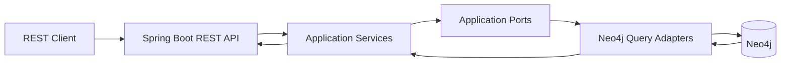
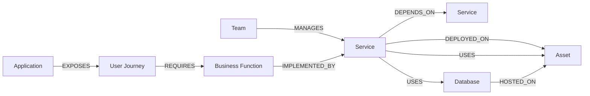

# Topology Service

Reference service for exploring **enterprise topology, dependency analysis and business-impact traversal** using Java, Spring Boot and Neo4j.

The service models technical and business entities as a graph and exposes REST APIs for questions such as:

- Which services does this service depend on?
- Which downstream services depend on it?
- Which applications and user journeys could be affected by a service failure?
- What is the blast radius of an infrastructure asset?
- Which team owns a service?
- What business context is connected to a technical component?

The goal is to show how a graph model can connect **infrastructure, services and business context** without leaking database-specific concerns into the application layer.

## High-level architecture



The code follows a ports-and-adapters style separation:

- **API layer** — controllers, validation and response mapping
- **Application layer** — use-case orchestration
- **Ports** — persistence/query abstractions
- **Infrastructure adapters** — explicit Cypher queries through `Neo4jClient`
- **Domain results** — database-agnostic objects returned to the application layer

## Domain model



This model makes it possible to traverse from a technical component toward business-facing impact.

For example:

```text
Infrastructure Asset
        ↓
     Service
        ↓
 Business Function
        ↓
  User Journey
        ↓
  Application
```

## Main use cases

### Service dependencies

```http
GET /api/v1/services/{serviceId}/dependencies?depth=2
```

Returns upstream services reachable through `DEPENDS_ON` relationships.

Traversal depth is bounded between 1 and 5 hops.

### Service dependents and derived business impact

```http
GET /api/v1/services/{serviceId}/dependents?depth=2
```

Returns downstream services depending on the selected service and derives the connected:

- business functions
- user journeys
- applications

### Service business context

```http
GET /api/v1/services/{serviceId}/business-context
```

Returns the business-oriented context of a service:

- implemented business functions
- related user journeys
- exposed applications
- managing teams

### Asset impact summary

```http
GET /api/v1/assets/{assetId}/impact-summary
```

Calculates a technical-to-business blast radius by traversing services that are:

- deployed on the asset
- directly using the asset
- using a database hosted on the asset

The resulting impact includes services, business functions and user journeys.

### Asset impact context

```http
GET /api/v1/assets/{assetId}/impact-context
```

Extends the impact analysis with application-level grouping, allowing impacted user journeys to be associated with the applications exposing them.

### Cross-entity search

```http
GET /api/v1/search?query=...
```

Performs case-insensitive partial search across:

- assets
- services
- business functions
- applications
- user journeys
- teams

## Technology stack

- **Java 25**
- **Spring Boot 4**
- Spring Web
- Spring Validation
- Spring Data Neo4j
- Neo4j / Cypher
- Spring Boot Actuator
- OpenAPI / Swagger UI
- Maven
- Docker Compose

## Why Neo4j

The use cases in this project are relationship-centric rather than record-centric.

Questions such as:

> "Which applications are indirectly affected if this asset fails?"

or:

> "Which business journeys depend on services downstream from this component?"

map naturally to graph traversal.

The repository deliberately keeps complex traversal logic in explicit Cypher queries instead of hiding it behind generic repository abstractions. This makes traversal depth, direction and impact propagation visible in the code.

## Local environment

Neo4j can be started locally through Docker Compose.

### Prerequisites

- Docker
- Docker Compose plugin
- JDK 25
- Maven

Create `neo4j_auth.txt` in the repository root using the format:

```text
neo4j/your-local-password
```

The file must not be committed.

Start Neo4j:

```bash
docker compose up -d
```

Check the container:

```bash
docker compose ps
```

Neo4j Browser:

```text
http://localhost:7474
```

Bolt endpoint:

```text
bolt://localhost:7687
```

## Application configuration

The application reads Neo4j connection settings from environment variables, with local defaults defined in `application.yml`.

```yaml
spring:
  neo4j:
    uri: ${NEO4J_URI:bolt://localhost:7687}
    authentication:
      username: ${NEO4J_USERNAME:neo4j}
      password: ${NEO4J_PASSWORD:your-local-password}
```

For local development, prefer overriding the password through the `NEO4J_PASSWORD` environment variable rather than storing real credentials in source control.

## Run the service

With Neo4j running:

```bash
mvn spring-boot:run
```

The service starts on:

```text
http://localhost:8080
```

Swagger UI:

```text
http://localhost:8080/swagger-ui
```

OpenAPI document:

```text
http://localhost:8080/api-docs
```

Health endpoint:

```text
http://localhost:8080/actuator/health
```

## Useful Neo4j queries

Visualize relationships:

```cypher
MATCH p=()-[r]->()
RETURN p
LIMIT 50
```

Visualize nodes:

```cypher
MATCH (n)
RETURN n
LIMIT 50
```

Inspect the logical schema:

```cypher
CALL db.schema.visualization()
```

## Design decisions

### Explicit graph traversals

Complex dependency and impact queries use `Neo4jClient` directly so Cypher remains visible and intentional.

### Bounded dependency traversal

Service dependency traversal is limited to five hops to avoid uncontrolled graph expansion.

### Database-independent application layer

Neo4j-specific objects do not cross the infrastructure boundary. Query adapters map results into domain records before returning them to application services.

### Thin controllers

Controllers handle validation, delegation and API mapping. Graph traversal logic stays outside the HTTP layer.

### Separate technical and business views

The graph connects infrastructure and services with business functions, journeys and applications, allowing the same topology to support both technical dependency analysis and business-impact analysis.

## Current limitations

This repository is a reference project, not a production-ready topology platform.

Areas that would require further work for production use include:

- authentication and authorization
- graph ingestion and synchronization pipelines
- versioning and historical topology snapshots
- full-text indexes for large-scale search
- pagination for large result sets
- caching
- metrics and distributed tracing
- resilience policies
- data-quality and ownership rules
- larger integration and performance test coverage

## Potential extensions

Possible next steps include:

- ingesting topology data from CMDB or service catalogs
- importing Kubernetes, cloud or API dependency metadata
- exposing topology context to AI agents or MCP tools
- adding incident-oriented blast-radius queries
- visualizing dependency paths in a dedicated frontend
- maintaining historical graph snapshots for change-impact analysis

## Local Neo4j reset

Stop containers while keeping data:

```bash
docker compose down
```

Remove persisted Docker volumes:

```bash
docker compose down -v
```

> This permanently deletes the local Neo4j data stored in the Docker volumes.

## Purpose

The project is intended as a hands-on architecture reference for reasoning about **enterprise dependency graphs, technical topology and business impact**.

It demonstrates how graph traversal can bridge low-level infrastructure relationships and higher-level business context while keeping API, application and persistence concerns separated.
